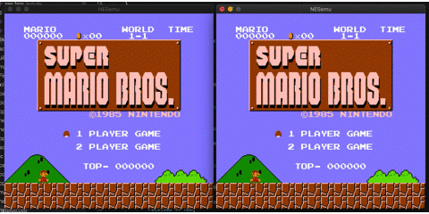

## onlineNESemu [WIP] 


### [WIP]
- [ ] APU
- [ ] other MAPPERs (This is implemented only for mapper0.)
### require
```
brew install sfml
```

### build
```
mkdir build
cd build
cmake ..
make
```

### run command
`./NESemu nes_file controller remote_ip port `

#### example
p1(host)
```
./NESemu nice.nes p1 192.168.1.10 55001
```

p2
```
./NESemu nice.nes p2 192.168.1.11 55001
```

### Copyright
onlineNESemu is licensed by GPL3.
And, this is a fork of amhndu/SimpleNES with the addition of an online screen and an online controller. Also, some code has tinificated for learn.
